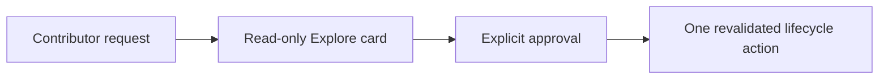

---
artifact_metadata:
  schema: "ai-sdlc-artifact-metadata/v1"
  feature: "011-guided-explore-apply-flow"
  artifact: "commit-message.md"
  path: "specs/011-guided-explore-apply-flow/commit-message.md"
  workspace: "implementation"
  skill: "ai-sdlc-conventional-commit"
  flow_mode: "full"
  state_file: "specs/011-guided-explore-apply-flow/_ai_sdlc/state.toon"
  decision_log: "specs/011-guided-explore-apply-flow/decision-log.md"
  status: "approved"
  owner: "Repository Maintainers"
  created_at: "2026-07-27"
  updated_at: "2026-07-27"
  trace_ids:
    - "AC-001"
    - "AC-002"
    - "AC-003"
    - "AC-004"
    - "AC-005"
    - "AC-006"
    - "AC-007"
    - "AC-008"
    - "AC-009"
    - "AC-010"
  related_artifacts:
    - "specs/011-guided-explore-apply-flow/commit-readiness.md"
    - "specs/011-guided-explore-apply-flow/validation.md"
  validation:
    - "conventional commit validator passed with full traceability"
  metatags:
    - "ai-sdlc"
    - "implementation"
    - "ai-sdlc-conventional-commit"
    - "commit-message"
    - "approved"
---

# Commit Message

````text
feat(flow): add guided explore and apply workflow

Spec: specs/011-guided-explore-apply-flow
Task: T001, T002, T003, T004, T005, T006, T007, T008, T009, T010, T011

Business context:
Give contributors one readable entrypoint for selecting AI SDLC skills while preserving explicit approval, project context, and reviewer independence.

Implementation details:
- Add intent-first Explore cards with evidence hashes, role and rigor explanations, context economics, workspace guards, and drift fingerprints.
- Add one-action Apply dispatch, navigator integration, spec-first review ordering, project-scoped packaging, generated catalogs, and onboarding guidance.
- Preserve direct skill invocation and support prerelease SemVer module identities.

Mermaid diagram:


How to test:
1. Explore a refinement or implementation request and inspect the Markdown, TOON, and JSON card evidence.
2. Change a fingerprinted source and confirm Apply rejects route drift without mutation.
3. Run the reviewed validation plan and documentation, module, compatibility, and install-smoke gates.

Validation:
- python3 skills/ai-sdlc-validation/scripts/run_validation.py --root . --plan specs/011-guided-explore-apply-flow/_ai_sdlc/validation-plan.json --output specs/011-guided-explore-apply-flow/_ai_sdlc/validation-receipt.json --timeout 900 --full-flow --feature 011-guided-explore-apply-flow --state-workspace implementation -> 12/12 passed
- python3 skills/ai-sdlc-validation/scripts/run_validation.py --root . --plan specs/011-guided-explore-apply-flow/_ai_sdlc/validation-plan.json --output specs/011-guided-explore-apply-flow/_ai_sdlc/validation-receipt.json --verify --full-flow --feature 011-guided-explore-apply-flow --state-workspace implementation -> current
- git diff --check -> passed
````
