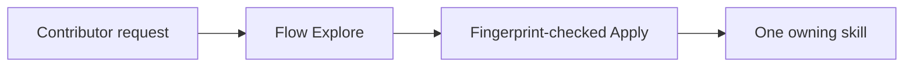

---
artifact_metadata:
  schema: "ai-sdlc-artifact-metadata/v1"
  feature: "012-deduplicate-skill-entrypoints"
  artifact: "commit-message.md"
  path: "specs/012-deduplicate-skill-entrypoints/commit-message.md"
  workspace: "implementation"
  skill: "ai-sdlc-conventional-commit"
  flow_mode: "quick"
  state_file: "specs/012-deduplicate-skill-entrypoints/_ai_sdlc/state.toon"
  decision_log: "specs/012-deduplicate-skill-entrypoints/decision-log.md"
  status: "approved"
  owner: "Repository Maintainers"
  created_at: "2026-07-27"
  updated_at: "2026-07-27"
  trace_ids:
    - "AC-001"
    - "AC-002"
    - "AC-003"
    - "AC-004"
    - "AC-005"
    - "AC-006"
    - "DEC-001"
  related_artifacts:
    - "specs/012-deduplicate-skill-entrypoints/commit-readiness.md"
    - "specs/012-deduplicate-skill-entrypoints/validation.md"
  validation:
    - "conventional commit validator passed with traceability"
  metatags:
    - "ai-sdlc"
    - "implementation"
    - "ai-sdlc-conventional-commit"
    - "commit-message"
    - "approved"
---

# Commit Message

````text
refactor(skills)!: consolidate guided routing into flow

Spec: specs/012-deduplicate-skill-entrypoints
Task: T001, T002, T003, T004, T005, T006

Business context:
Reduce skill-selection ambiguity by giving contributors one transparent Explore then Apply entrypoint without losing lifecycle safety signals.

Implementation details:
- Remove the duplicate navigator package and update active inventories, compatibility, installation, catalogs, and documentation to 44 unique skills.
- Migrate intent routes, active-state resume, prerequisite ordering, packaged-skill discovery, and shared-base branching into flow.
- Retain required shared-runtime mirrors and generic test fixtures, and make validation/review planners deletion-aware.

Mermaid diagram:


How to test:
1. Explore former navigator intents and verify flow selects the expected owning skill or prerequisite.
2. Run the repository validation plan and confirm 44 unique skills, current catalogs, and project-scoped installation.
3. Scan active surfaces and confirm the retired navigator ID is absent outside explicit migration and historical evidence.

Validation:
- python3 skills/ai-sdlc-validation/scripts/run_validation.py --root . --plan specs/012-deduplicate-skill-entrypoints/_ai_sdlc/validation-plan.toon --output specs/012-deduplicate-skill-entrypoints/_ai_sdlc/validation-receipt.toon --verify -> current; 12/12 commands passed
- python3 skills/ai-sdlc-sdd/scripts/validate_spec.py specs/012-deduplicate-skill-entrypoints --quick-flow -> passed
- git diff --check -> passed

BREAKING CHANGE: ai-sdlc-navigator is removed. Use ai-sdlc-flow Explore or invoke a known owning skill directly.
````
