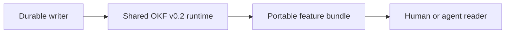

# Commit Message

````text
feat(skills)!: adopt OKF v0.2 artifact bundles

Spec: specs/013-role-guided-installable-flow
Task: T001, T002, T003, T004, T005, T006, T007, T008, T009, T010, T011, T012, T013, T014, T015, T016, T017, T018, T019, T020, T021, T022, T023, T024

Business context:
Make generated AI SDLC context readable and portable while reducing rediscovery, directory ambiguity, and reviewer risk caused by opaque or duplicated artifact routes.

Implementation details:
- Add one installable OKF v0.2 renderer, bounded parser, artifact profiles, provenance rules, bundle indexing, validation, and migration support.
- Migrate durable lifecycle, feature, change-set, context, evidence, and workflow writers to explicit OKF profiles.
- Replace workspace human indexes with feature-local bundle indexes and hard-cut project context and module paths under `_ai_sdlc`.
- Update all skill preparation steps, generated references, Feature 013 artifacts, tests, and validation contracts.

Mermaid diagram:


How to test:
1. Validate both Feature 013 bundles and inspect their feature-local `index.md` navigation.
2. Run the shared runtime suite and verify OKF parsing, provenance, migration, and hard-cut path behavior.
3. Run the Feature 013 validation plan and confirm all SDD, docs, compatibility, and installation gates pass.

Validation:
- PYTHONPYCACHEPREFIX=/tmp/ai-sdlc-pyc PYTHONPATH=skills/ai-sdlc-shared-runtime/scripts python3 skills/ai-sdlc-validation/scripts/run_validation.py --root . --plan specs/013-role-guided-installable-flow/_ai_sdlc/validation-plan.toon --output specs/013-role-guided-installable-flow/_ai_sdlc/validation-receipt.toon --verify --full-flow --feature 013-role-guided-installable-flow -> current; 11/11 commands passed
- python3 skills/ai-sdlc-commit-prep/scripts/check_commit_ready.py --full-flow --spec specs/013-role-guided-installable-flow -> passed
- git diff --check -> passed

BREAKING CHANGE: runtime project context now lives at `_ai_sdlc/context/project-context.md`; workspace `specs-index.md` files are removed in favor of feature-local `index.md`.
````
