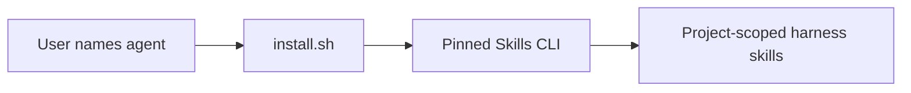

# Commit Message

````text
feat(install): add one-line agent installer

Spec: specs/014-one-line-agent-installer
Task: T001, T002, T003, T004, T005

Business context:
Make first-time harness installation one memorable command while preserving an
explicit agent boundary and the existing audited installation path.

Implementation details:
- Add a POSIX shell wrapper that pins Skills CLI, disables telemetry, and
  installs every harness skill project-scoped for one explicit agent.
- Add offline coverage for direct and stdin execution, alternate agents,
  overrides, invalid input, missing prerequisites, and delegated failures.
- Lead the README and install guide with the one-line command while retaining
  immutable revision and global-install guidance.

Mermaid diagram:


How to test:
1. Run the installer unittest and confirm all seven offline scenarios pass.
2. Run the documentation validator and documentation tests.
3. Verify the Feature 014 validation receipt and SDD gates are current.

Validation:
- python3 -m unittest tests/test_install_sh.py -> passed; 7 tests
- python3 docs/scripts/validate_docs.py -> passed; 186 pages and 44 skills
- python3 -m pytest -q docs/tests -> passed; 44 tests
- Feature 014 validation receipt -> current; 9 commands; 0 failures
- git diff --check -> passed
````
