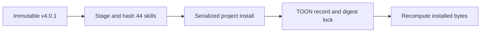

# Commit Message

````text
fix(install): enforce TOON-only native installation

Spec: specs/015-executable-skill-harness-v4
Task: T011
Decision: DEC-009

Business context:
The first tagged v4 installation proved that the external installer generated a non-TOON lock, violating the release's hard machine-boundary requirement.

Implementation details:
- Replace the external consumer path with a Harness-owned installer that binds a clean Git revision, validates the managed inventory, rejects links and non-TOON artifacts, stages and rehashes every skill, and rolls back caught partial-application failures.
- Add portable install-record v2 plus a deterministic content-addressed TOON lock and an installed validator that recomputes every managed digest.
- Narrow validated installation to project-scoped Codex, pin the primary command to immutable v4.0.1, and document v4.0.0 as superseded without moving its tag.
- Add native installer unit and installed-layout smoke coverage, update CI and generated catalogs, and keep every repository machine boundary TOON-only.

Mermaid diagram:


How to test:
1. Verify the current Feature 015 receipt and inspect the 17 command results.
2. Run the complete 95-file suite and native installed-layout smoke.
3. Build documentation strictly and validate all rendered local targets.
4. Run exact compatibility and a fresh tagged native installation.

Validation:
- python3 skills/ai-sdlc-validation/scripts/run_validation.py --root . --plan specs/015-executable-skill-harness-v4/_ai_sdlc/validation-plan.toon --output specs/015-executable-skill-harness-v4/_ai_sdlc/validation-receipt.toon --verify --quick-flow -> current; 17/17 commands passed
- python3 skills/ai-sdlc-shared-runtime/scripts/ai_sdlc_test_suite.py --format toon -> passed; 95/95 files
- python3 skills/ai-sdlc-shared-runtime/tests/install_smoke.py --mode native --source . --agent codex --quick-flow -> passed
- python3 skills/ai-sdlc-shared-runtime/scripts/ai_sdlc_compatibility.py --git-executable /usr/bin/git --format toon -> compatible
- mkdocs build --strict and python3 docs/scripts/validate_rendered.py site -> passed; 201 HTML pages and 5,423 local targets
- git diff --check -> passed
````
