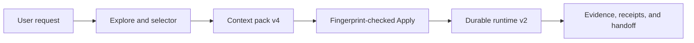

# Commit Message

````text
chore(release)!: publish v4.0.0

Spec: specs/015-executable-skill-harness-v4
Task: T001, T002, T003, T004, T005, T006, T007, T008, T009, T010

Business context:
Make every installable skill deterministic, context-complete, recoverable, and auditable while eliminating dual machine contracts that caused routing, replay, and maintenance drift.

Implementation details:
- Upgrade all 44 skills to semantic v2 DAGs with generated routers, explicit context and handoff nodes, StepCards, gates, retry policy, and recovery evidence.
- Add context pack v4 with critical-anchor recall, source authority, exact ranges, token economics, fingerprints, and fail-closed direct-read fallback.
- Integrate flow v3, workflow v2, runtime v2, host adapter v2, and handoff v2 with durable per-step journals, idempotency, strict replay, effect receipts, and interrupted-completion recovery.
- Make canonical TOON the only structured machine boundary across contracts, configuration, fixtures, state, journals, receipts, historical evidence, and generated output.
- Add complete per-file testing, deterministic and provider-neutral evaluation protocols, compatibility gates, migration guidance, release documentation, code review, and security review.

Mermaid diagram:


How to test:
1. Verify the current Feature 015 receipt and inspect the 17 command results.
2. Run the complete 94-file suite and both deterministic evaluation modes.
3. Build documentation strictly and validate all rendered local targets.
4. Run the compatibility history audit before and after the release commit.

Validation:
- python3 skills/ai-sdlc-validation/scripts/run_validation.py --root . --plan specs/015-executable-skill-harness-v4/_ai_sdlc/validation-plan.toon --output specs/015-executable-skill-harness-v4/_ai_sdlc/validation-receipt.toon --verify --quick-flow -> current; 17/17 commands passed
- python3 skills/ai-sdlc-shared-runtime/scripts/ai_sdlc_test_suite.py --format toon -> passed; 94/94 files
- python3 skills/ai-sdlc-shared-runtime/scripts/ai_sdlc_compatibility.py --root . --git-base v2.1.0 --git-executable /usr/bin/git --allow-pending-last --format toon -> compatible
- mkdocs build --strict and python3 docs/scripts/validate_rendered.py site -> passed; 201 HTML pages and 5,428 local targets
- git diff --check -> passed

BREAKING CHANGE: pre-v4 machine artifacts must be regenerated as canonical TOON; alternate readers, serializers, and legacy in-place conversion are removed.
````
