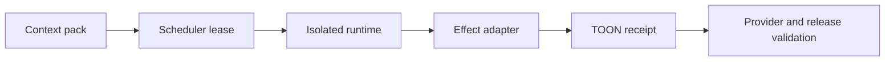

# Commit Message

````text
feat(harness): ship production orchestration and effects

Business context

Turn the deterministic skill runtime into a production-capable local harness
with durable scheduling, executable effect boundaries, provider proof, and
portable project-scoped installation.

Implementation details

- add bounded lease scheduling, heartbeat, recovery, event replay, retry
  exhaustion, context freshness, and immutable-plan compare-and-commit
- add allowlisted workspace and HTTPS effect drivers with approval,
  confinement, redirect rejection, and idempotent TOON receipts
- certify current-session TC-012 execution and Codex/Claude Code install
  profiles while upgrading all 45 semantic skill graphs to v4.1.0

Change flow

Per-step context -> scheduler lease -> isolated runtime -> effect receipt ->
provider and release evidence

Mermaid diagram



How to test

- run the canonical 18-command validation plan and verify its receipt
- run both native install profiles through complete installed workflows
- build strict documentation and validate rendered local targets

Validation

- 18/18 canonical validation commands passed
- 99/99 skill-owned test files passed
- Codex and Claude Code native install workflows passed
- provider-executed TC-012 passed all six scenarios
- strict docs build produced 205 pages with 5,508 valid local targets

Spec: specs/016-production-harness-completion
Task: T001, T002, T003, T004, T005, T006, T007, T008, T009
Validation: specs/016-production-harness-completion/_ai_sdlc/validation-receipt.toon
````
