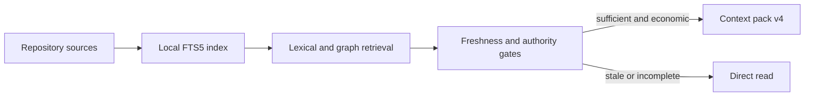

# Commit Message

````text
feat(context-cache): add deterministic local retrieval

Business context

Reduce repeated repository reads and token use while preserving authoritative
sources, deterministic evidence, and safe direct-read recovery.

Implementation details

- add opt-in SQLite FTS5 lexical and typed graph-enhanced retrieval with
  incremental indexing, freshness checks, bounded traversal, and safe purge
- add context-pack/v4 assembly with mandatory owning steps, complete critical
  anchors, evidence-only repository ranges, and a 15 percent savings gate
- add deterministic TOON benchmarks, module installation, compatibility,
  documentation, security review, and full-flow lifecycle evidence

Change flow

Repository sources -> local deterministic index -> bounded evidence pack ->
freshness and authority gates -> packed context or direct read

Mermaid diagram



How to test

- build and query the optional cache in a temporary Git repository
- add, modify, delete, or hide eligible sources and confirm safe fallback
- install default and context-cache module profiles and compare inventories

Validation

- 17/17 canonical validation commands passed
- 100/100 skill-owned test files passed
- 8/8 focused context-cache tests passed
- 18/18 refinement artifacts complete with zero blockers
- repository diff hygiene and TOON-only interchange checks passed

Spec: specs/017-local-context-cache
Task: T001, T002, T003, T004, T005, T006, T007, T008
Validation: specs/017-local-context-cache/_ai_sdlc/validation-receipt.toon
````
