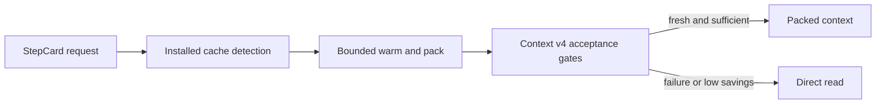

# Commit Message

````text
feat(context-cache): integrate deterministic runtime cache

Business context

Reduce repeated repository reads during normal harness execution while keeping
authoritative sources, deterministic context engineering, and direct-read
recovery intact.

Implementation details

- activate the optional project-installed cache from StepCard compilation with
  strict TOON policy, manifest clamps, and bounded local processes
- serialize warmers, recheck source snapshots before atomic publication, and
  recover from contention, corruption, stale state, and unavailable FTS5
- add aggregate-only observations, symlink-safe confinement, process
  concurrency tests, documentation, and full lifecycle evidence

Change flow

StepCard request -> installed-cache detection -> bounded warm and pack -> v4
authority, freshness, anchor, budget, and economics gates -> packed context or
authoritative direct read

Mermaid diagram



How to test

- run focused context-cache and StepCard suites
- run the complete shared-runtime and documentation regressions
- verify the canonical TOON receipt against the current workspace fingerprint

Validation

- 10/10 canonical validation commands passed
- 11/11 focused context-cache tests passed
- 19/19 focused StepCard tests passed
- 178 shared-runtime tests passed in the visible full run
- 18/18 refinement artifacts complete with zero blockers and warnings

Spec: specs/018-context-cache-runtime
Task: T001, T002, T003, T004, T005, T006, T007, T008
Validation: specs/018-context-cache-runtime/_ai_sdlc/validation-receipt.toon
````
