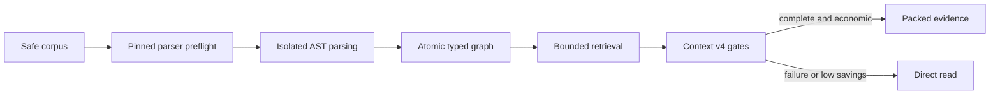

# Commit Message

````text
feat(context-cache): index whole codebase with AST graph

Business context

Reduce repeated broad repository reads by making code structure searchable in
the local context layer while preserving deterministic harness authority,
bounded context engineering, and safe direct-read recovery.

Implementation details

- parse TypeScript, Python, JavaScript, Java, C#, PHP, Shell, C++, Go, Rust,
  Kotlin, and Swift with exact hash-locked Tree-sitter runtimes
- build stable file, chunk, symbol, occurrence, call, import, path, adjacency,
  and specification-trace relations in the atomic local cache lifecycle
- isolate parsers with time, environment, network, graph-size, and traversal
  bounds; reject incomplete ASTs and recover to authoritative direct reads
- integrate lexical and symbol seeds with deterministic typed graph expansion,
  TOON receipts, context economics, documentation, and release audits

Change flow

Safe corpus inventory -> pinned parser preflight -> isolated AST parsing ->
atomic graph publication -> lexical and symbol seeding -> bounded typed
traversal -> context v4 acceptance gates -> packed evidence or direct read

Mermaid diagram



How to test

- run the 31 focused context-cache, language, graph, and retrieval tests
- run the offline hash-locked install smoke and two-build full-corpus audit
- run shared-runtime, documentation, refinement, SDD, and diff-hygiene gates
- verify the canonical TOON receipt against the finalized workspace

Validation

- 12/12 canonical validation commands passed
- 31/31 focused tests passed across all twelve language grammars
- 178/178 shared-runtime tests and 47/47 documentation tests passed
- full-corpus determinism, 100 percent critical recall, parser fault recovery,
  code review, and security review passed with no unresolved finding

Spec: specs/019-whole-codebase-graph
Task: T001, T002, T003, T004, T005, T006, T007, T008, T009, T010
Validation: specs/019-whole-codebase-graph/_ai_sdlc/validation-receipt.toon
````
