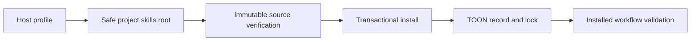

# Commit Message

````text
feat(installer): add portable agent project profiles

Business context

Let Agent Skills-compatible hosts install AI SDLC Harness on Linux, macOS, or
Windows without pretending that every agent product shares one vendor path or
has been behaviorally certified.

Implementation details

- add a Python 3.10+ bootstrap and configurable `agent-project` profile with a
  required safe repository-relative skills root
- preserve fixed Codex and Claude project profiles and the POSIX shell entrypoint
- add portable locking, dynamic install-record validation, and recorded-root
  discovery throughout installed runtime helpers
- reject traversal, linked ancestors, protected-root case variants, Windows
  reserved paths, and credential-bearing HTTP-family remotes
- document the package-versus-host support boundary and add native OS CI

Change flow

Choose host root -> verify immutable source -> normalize project target ->
stage and hash skills -> atomically install -> write TOON evidence -> validate
the installed runtime.

Mermaid diagram



How to test

- run the Python 3.11 portable installer tests
- run custom, Codex, and Claude native installed-layout smokes
- run the canonical shared-runtime, docs, compatibility, SDD, and diff gates
- require Ubuntu, macOS, and Windows portable-install jobs before publication

Validation

- 20/20 Python 3.11 portable installer tests passed
- 14/14 canonical validation commands passed
- all three installed-layout smoke profiles passed
- strict documentation and rendered-link validation passed
- security review passed with no open finding

Spec: specs/021-universal-agent-installer
Task: T001, T002, T003, T004, T005, T006
Validation: specs/021-universal-agent-installer/_ai_sdlc/validation-receipt.toon
````
