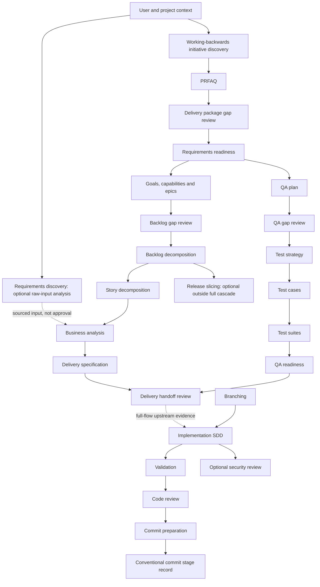

---
artifact_metadata:
  schema: ai-sdlc-artifact-metadata/v1
  feature: 024-skill-execution-reinforcement
  artifact: reinforcement-report.md
  path: specs/024-skill-execution-reinforcement/reinforcement-report.md
  workspace: implementation
  skill: ai-sdlc-sdd
  flow_mode: quick
  state_file: specs/024-skill-execution-reinforcement/_ai_sdlc/state.toon
  decision_log: specs/024-skill-execution-reinforcement/decision-log.md
  status: review
  owner: implementation agent
  created_at: 2026-09-08
  updated_at: 2026-09-08
  trace_ids: [AC-001, AC-002, AC-003, AC-004, AC-005]
  related_artifacts: [requirements.md, design.md, test-cases.md, qa.md, tasks.md]
  validation: []
  metatags: [ai-sdlc, implementation, ai-sdlc-sdd, reinforcement-report, review]
---

# Cross-product execution reinforcement

## Scope and archaeology

The checkout is AI SDLC Harness, with AI SDLC Loop at the existing
`products/ai-sdlc-loop` submodule. Inventory: **48 Harness skills and 21 Loop
skills**. All were mapped and changed. Both initial working trees contained
user changes, including new discovery skills; those changes were preserved.
No branch switch, commit, submodule-pointer update or publication was performed.

Authority was derived from `CONTRIBUTING.md`, maintainer/validation guides,
all routers and semantic manifests, owning prepare/execute/validate/handoff
procedures, artifact profiles and state graph, helper inventories, schemas,
examples, tests, evals, installers, module catalogs and documentation generators.
The new discovery packages are included in the working-source inventory.
The base filesystem name does not imply a separate third skills product.

## Resulting architecture

The existing architecture remains: concise skill router -> manifest entrypoint
and dependency closure -> minimum sufficient context -> owning operation ->
independent output validation -> evidence-backed handoff. Harness retains TOON
StepCards, feature-state profiles, scheduler/runtime journals, adapter effects,
canonical artifacts and indexes. Loop retains its smaller fixed lifecycle,
fingerprint-bound approvals and product-local runtime.

Shared execution rules cover input classes, freshness, failures, bounded repair,
completion and authorized continuation. The context compiler loads a declared
sibling execution reference as mandatory source, fails if it is unavailable,
and fingerprints it with the graph. Preflight uses direct compilation when the
optional cache cannot prove retention of that reference. Graph selection and
context results are canonical and repeatable for unchanged inputs.

Deterministic code now rejects completed nodes without completed dependencies,
and semantic handoff graphs whose action outputs bypass a validation node.
The compact Loop selector validates paths, owners, node identity, dependencies,
cycles, reachability and completion closure without executing actions. Its
`complete` flag describes the selected closure, not feature readiness or approval.

Loop rechecks the source snapshot after commands. Commit approval and Commit
reuse the same current-evidence validator: schema/identity, actual passing
command records, fingerprints, current changed files and current engineering
quality report. `evidence-check` exposes that gate read-only. Commit preparation
proposes contents; Commit alone validates separate approval and creates a commit.

## Actual major skill graph

Edges above come from existing artifact profiles and feature-state stage
predecessors, not a newly invented universal phase order. The conventional
commit helper may validate message content during preparation; its separate
lifecycle record remains after preparation. Helper calls are not automatically
separate lifecycle transitions. This distinction preserves existing contracts.

```mermaid
flowchart LR
  raw[Raw request] -. optional .-> discovery[Loop requirements discovery]
  discovery --> requirements[Requirements review]
  requirements --> specify[Specify]
  specify --> approval[Implement approval]
  approval --> implement[Implement]
  implement --> quality[Engineering quality gate]
  quality --> verify[Verify]
  verify --> prep[Commit preparation]
  prep --> commitApproval[Separate commit approval]
  commitApproval --> commit[Commit]
  verify -. source drift or failing checks .-> implement
```

A return to repair requires an observed failure and existing scope/authority;
changed requirements return to Specify and invalidate prior approval. The graph
selector never manufactures completed evidence to move through these edges.

Cross-lifecycle helpers remain optional service owners: Flow routes; Project
Context/Context Cache retrieve; Change Set isolates proposals; Change Impact
traces invalidation; Delivery Graph indexes evidence; Policy evaluates rules;
Quality Lenses/Evidence Council advise; Workflow compiles; Runtime journals;
Scheduler dispatches; Host Adapter negotiates/effects; Doctor diagnoses;
Package Trust checks provenance; Research, UX, Architecture and Retrospective
produce their own bounded artifacts. They do not acquire feature-state
transition authority merely by importing shared runtime.

## Evidence-driven corrections

| Observed problem | Change | Regression evidence |
| --- | --- | --- |
| `completed_steps=[execute]` accepted without context; terminal handoff accepted without prerequisites | Dependency-closed completion validation in both semantic selectors | Two reproductions failed before correction and pass after |
| A handoff could depend on action directly and omit validation | Every terminal-closure action must precede a validation node | Manifest mutation failed before correction and passes after |
| Shared instructions could change without changing graph/context identity | Mandatory sibling reference resolution and hashing | Missing reference blocks; changed reference changes both fingerprints |
| Loop passing command could mutate source yet record ready for the earlier snapshot | Post-command scope/fingerprint recheck; failed evidence retained | In-command mutation regression failed before correction and passes after |
| Commit approval accepted stale or tampered verification | Shared current-evidence gate at approval and commit | Both negative approval regressions failed before correction and pass after |
| `ownership` and `membership` matched release keyword `ship` | Word-boundary matching; specific discovery/review/quality routes precede generic routes | Five routing cases failed before correction and pass after; generic diff review preserved |
| Compact Loop stage graphs existed without an executable selector | Read-only interpretation of their existing v1 schema | Stable traversal of all native entrypoints; cycles, missing paths and invalid histories rejected |
| Loop commit-prep included direct commit instructions and mandatory Harness SDD assumptions | Product-local receipt gate and handoff to Commit; optional SDD remains supported | Loop lifecycle, approval, integration and installed-selector tests |
| Utility preflight instructed unregistered feature-state transitions | Bind registered skills to actual stages and keep utilities outside feature-state mutation | Lifecycle-binding consistency test plus all-skill tests |
| New discovery schema lacked the repository contract marker; script inventory expected an obsolete count | Add contract marker in both products and correct catalog expectation | Schema contract suite and documentation tests |

## Per-skill changes

Every row retains its specialized purpose, required inputs, artifact format,
validator and public identity. The common reinforcement adds source/status-based
input resolution, explicit selection boundaries, shared failure classes, bounded
repair and evidence-based completion. Handoff wording now distinguishes a
standalone request from an already authorized coordinator/cascade.

Verification keys: **H** = nine structural eval scenarios for that Harness
skill plus its existing local helper tests; **L** = nine structural scenarios
for that semantic Loop skill plus the product integration suite; **N** = every
compact native entrypoint traversed to its exact terminal closure, byte-identical
reselection and native negative/mutation cases. These are executable contract
checks, not claims that an LLM understood every possible business requirement.

### Harness

| Skill | Problem | Change and resulting responsibility | Verification |
| --- | --- | --- | --- |
| [ai-sdlc-approvals-sandbox](../../skills/ai-sdlc-approvals-sandbox/SKILL.md) | Input provenance and recovery rules were distributed across prose. | Explicit boundary and shared input/failure/completion decisions. Decide, request, and report sandbox escalation for AI SDLC commands only when the sandbox blocks a required action or the task explicitly requires approved external access. Keep utility work outside automatic feature-state transitions. | H |
| [ai-sdlc-architecture](../../skills/ai-sdlc-architecture/SKILL.md) | Input provenance and recovery rules were distributed across prose. | Explicit boundary and shared input/failure/completion decisions. Preserve traceable architecture boundaries, decisions, and risks. Keep utility work outside automatic feature-state transitions. | H |
| [ai-sdlc-ba](../../skills/ai-sdlc-ba/SKILL.md) | Input provenance and recovery rules were distributed across prose. | Explicit boundary and shared input/failure/completion decisions. Convert a vague AI SDLC feature, refactor, or workflow request into requirements-ready business context with actors, rules, assumptions, exclusions, and measurable acceptance criteria. Bind `ba_context` to `business-context.md` and registered predecessors/consumers. | H |
| [ai-sdlc-backlog-decomposition-and-task-planning](../../skills/ai-sdlc-backlog-decomposition-and-task-planning/SKILL.md) | Input provenance and recovery rules were distributed across prose. | Explicit boundary and shared input/failure/completion decisions. Convert planning structure into a delivery-oriented backlog with cross-functional work represented explicitly. Bind `backlog_decomposition` to `backlog.md` and registered predecessors/consumers. | H |
| [ai-sdlc-backlog-requirements-gap-review](../../skills/ai-sdlc-backlog-requirements-gap-review/SKILL.md) | Input provenance and recovery rules were distributed across prose. | Explicit boundary and shared input/failure/completion decisions. Review the incoming initiative package and determine whether it is specific enough to support backlog decomposition and release planning. Bind `backlog_gap_review` to `backlog-gap-review.md` and registered predecessors/consumers. | H |
| [ai-sdlc-branching](../../skills/ai-sdlc-branching/SKILL.md) | Input provenance and recovery rules were distributed across prose. | Explicit boundary and shared input/failure/completion decisions. Create or verify the correct Git-flow task branch before repo-tracked file mutation, keep branch names aligned with active specs, and hand completed work to validation and commit prep without mixing unrelated changes. Bind `branching` to `branch-plan.md` and registered predecessors/consumers. | H |
| [ai-sdlc-change-impact](../../skills/ai-sdlc-change-impact/SKILL.md) | Input provenance and recovery rules were distributed across prose. | Explicit boundary and shared input/failure/completion decisions. Trace changed sources to stale artifacts and safe reopen actions. Keep utility work outside automatic feature-state transitions. | H |
| [ai-sdlc-change-set](../../skills/ai-sdlc-change-set/SKILL.md) | Input provenance and recovery rules were distributed across prose. | Explicit boundary and shared input/failure/completion decisions. Create and validate an isolated, reviewable workspace before any authoritative specification mutation. Keep utility work outside automatic feature-state transitions. | H |
| [ai-sdlc-code-review](../../skills/ai-sdlc-code-review/SKILL.md) | Input provenance and recovery rules were distributed across prose. | Explicit boundary and shared input/failure/completion decisions. Review AI SDLC code, diffs, branches, commits, or completed implementations for correctness, regressions, contract drift, missing tests, SDD drift, and material maintainability risks. Bind `code_review` to `code-review.md` and registered predecessors/consumers. | H |
| [ai-sdlc-commit-prep](../../skills/ai-sdlc-commit-prep/SKILL.md) | Input provenance and recovery rules were distributed across prose. | Explicit boundary and shared input/failure/completion decisions. Prepare and create a safe AI SDLC commit by reviewing the branch and working tree, staging only related files, validating SDD evidence, using a valid Conventional Commit message, and reporting post-commit traceability. Bind `commit_prep` to `commit-readiness.md` and registered predecessors/consumers. | H |
| [ai-sdlc-context-cache](../../skills/ai-sdlc-context-cache/SKILL.md) | Input provenance and recovery rules were distributed across prose. | Explicit boundary and shared input/failure/completion decisions. Reuse fresh bounded repository evidence without changing authority. Keep utility work outside automatic feature-state transitions. | H |
| [ai-sdlc-conventional-commit](../../skills/ai-sdlc-conventional-commit/SKILL.md) | Input provenance and recovery rules were distributed across prose. | Explicit boundary and shared input/failure/completion decisions. Draft, validate, or repair an AI SDLC commit message that uses Conventional Commit syntax and includes SDD, business, implementation, testing, and validation traceability when the change is medium or large. Bind `conventional_commit` to `commit-message.md` and registered predecessors/consumers. | H |
| [ai-sdlc-delivery-graph](../../skills/ai-sdlc-delivery-graph/SKILL.md) | Input provenance and recovery rules were distributed across prose. | Explicit boundary and shared input/failure/completion decisions. Build a deterministic repository-wide lifecycle graph and answer trace, gap, coverage, and orphan questions from stable evidence anchors. Keep utility work outside automatic feature-state transitions. | H |
| [ai-sdlc-delivery-handoff-review](../../skills/ai-sdlc-delivery-handoff-review/SKILL.md) | Input provenance and recovery rules were distributed across prose. | Explicit boundary and shared input/failure/completion decisions. Run the final quality gate on the delivery package before it is treated as ready for implementation planning or handoff. Bind `delivery_handoff` to `delivery-handoff-review.md` and registered predecessors/consumers. | H |
| [ai-sdlc-delivery-package-gap-review](../../skills/ai-sdlc-delivery-package-gap-review/SKILL.md) | Input provenance and recovery rules were distributed across prose. | Explicit boundary and shared input/failure/completion decisions. Review an upstream discovery package and decide whether it is specific enough to decompose into delivery artifacts. Bind `delivery_package_gap_review` to `delivery-gap-review.md` and registered predecessors/consumers. | H |
| [ai-sdlc-delivery-spec-synthesis](../../skills/ai-sdlc-delivery-spec-synthesis/SKILL.md) | Input provenance and recovery rules were distributed across prose. | Explicit boundary and shared input/failure/completion decisions. Convert the clarified package and story set into a structured delivery specification. Bind `delivery_spec` to `delivery-spec.md` and registered predecessors/consumers. | H |
| [ai-sdlc-doctor](../../skills/ai-sdlc-doctor/SKILL.md) | Input provenance and recovery rules were distributed across prose. | Explicit boundary and shared input/failure/completion decisions. Explain installation health and upgrade impact before mutation. Keep utility work outside automatic feature-state transitions. | H |
| [ai-sdlc-engineering-quality-gate](../../skills/ai-sdlc-engineering-quality-gate/SKILL.md) | Input provenance and recovery rules were distributed across prose. | Explicit boundary and shared input/failure/completion decisions. Inspect a bounded implementation against repository evidence, remediate safe material defects, rerun relevant checks, and decide whether the current diff is ready for the next stage. Keep utility work outside automatic feature-state transitions. | H |
| [ai-sdlc-evidence-council](../../skills/ai-sdlc-evidence-council/SKILL.md) | Input provenance and recovery rules were distributed across prose. | Explicit boundary and shared input/failure/completion decisions. Combine multiple evidence perspectives while preserving authority. Keep utility work outside automatic feature-state transitions. | H |
| [ai-sdlc-flow](../../skills/ai-sdlc-flow/SKILL.md) | Input provenance and recovery rules were distributed across prose. | Explicit boundary and shared input/failure/completion decisions. Replace skill-order guesswork with one auditable Explore decision card and one fingerprinted Apply checkpoint. Keep utility work outside automatic feature-state transitions. | H |
| [ai-sdlc-goal-capability-and-epic-mapping](../../skills/ai-sdlc-goal-capability-and-epic-mapping/SKILL.md) | Input provenance and recovery rules were distributed across prose. | Explicit boundary and shared input/failure/completion decisions. Turn a clarified initiative package into a structured planning model of goals, roles, capabilities, and epics. Bind `goal_epic_mapping` to `goal-capability-map.md` and registered predecessors/consumers. | H |
| [ai-sdlc-host-adapter](../../skills/ai-sdlc-host-adapter/SKILL.md) | Input provenance and recovery rules were distributed across prose. | Explicit boundary and shared input/failure/completion decisions. Preserve workflow semantics across hosts, then execute only bounded negotiated effects with deterministic idempotency. Keep utility work outside automatic feature-state transitions. | H |
| [ai-sdlc-package-trust](../../skills/ai-sdlc-package-trust/SKILL.md) | Input provenance and recovery rules were distributed across prose. | Explicit boundary and shared input/failure/completion decisions. Fail closed on untrusted packages and measure delivery without content collection. Keep utility work outside automatic feature-state transitions. | H |
| [ai-sdlc-policy](../../skills/ai-sdlc-policy/SKILL.md) | Input provenance and recovery rules were distributed across prose. | Explicit boundary and shared input/failure/completion decisions. Resolve policy layers with provenance and evaluate actions against protected, versioned, waiver-aware rules. Keep utility work outside automatic feature-state transitions. | H |
| [ai-sdlc-prfaq-package-synthesis](../../skills/ai-sdlc-prfaq-package-synthesis/SKILL.md) | Input provenance and recovery rules were distributed across prose. | Explicit boundary and shared input/failure/completion decisions. Convert validated discovery notes into a decision-ready PRFAQ package and business requirements document. Bind `prfaq` to `prfaq.md` and registered predecessors/consumers. | H |
| [ai-sdlc-project-context](../../skills/ai-sdlc-project-context/SKILL.md) | Input provenance and recovery rules were distributed across prose. | Explicit boundary and shared input/failure/completion decisions. Generate durable repository memory and task-specific, bounded, freshness-aware context from explained safe sources. Keep utility work outside automatic feature-state transitions. | H |
| [ai-sdlc-qa](../../skills/ai-sdlc-qa/SKILL.md) | Input provenance and recovery rules were distributed across prose. | Explicit boundary and shared input/failure/completion decisions. Produce QA acceptance, regression, manual-check, and signoff evidence for AI SDLC changes and place QA refinement artifacts under `specs-refiniment/<feature-name>/<file.md>` when writing files. Bind `qa_plan` to `qa.md` and registered predecessors/consumers. | H |
| [ai-sdlc-qa-requirements-gap-review](../../skills/ai-sdlc-qa-requirements-gap-review/SKILL.md) | Input provenance and recovery rules were distributed across prose. | Explicit boundary and shared input/failure/completion decisions. Review the incoming delivery package and determine whether it is specific enough to support rigorous test design. Bind `qa_gap_review` to `qa-gap-review.md` and registered predecessors/consumers. | H |
| [ai-sdlc-qa-traceability-and-readiness-review](../../skills/ai-sdlc-qa-traceability-and-readiness-review/SKILL.md) | Input provenance and recovery rules were distributed across prose. | Explicit boundary and shared input/failure/completion decisions. Run the final QA gate on the generated test pack before execution starts. Bind `qa_traceability` to `qa-readiness.md` and registered predecessors/consumers. | H |
| [ai-sdlc-quality-lenses](../../skills/ai-sdlc-quality-lenses/SKILL.md) | Input provenance and recovery rules were distributed across prose. | Explicit boundary and shared input/failure/completion decisions. Apply reusable challenge lenses and finalize evidence-backed findings. Keep utility work outside automatic feature-state transitions. | H |
| [ai-sdlc-release-slicing-and-backlog-readiness-review](../../skills/ai-sdlc-release-slicing-and-backlog-readiness-review/SKILL.md) | Input provenance and recovery rules were distributed across prose. | Explicit boundary and shared input/failure/completion decisions. Run the final planning gate on the backlog package before estimation, roadmap slicing, or execution planning. Bind `release_slicing` to `release-slicing.md` and registered predecessors/consumers. | H |
| [ai-sdlc-requirements-discovery](../../skills/ai-sdlc-requirements-discovery/SKILL.md) | Input provenance and recovery rules were distributed across prose. | Explicit boundary and shared input/failure/completion decisions. Turn raw feature or task inputs into a sourced problem analysis, business options, and an actionable stakeholder elicitation plan. Keep utility work outside automatic feature-state transitions. | H |
| [ai-sdlc-requirements-readiness-review](../../skills/ai-sdlc-requirements-readiness-review/SKILL.md) | Input provenance and recovery rules were distributed across prose. | Explicit boundary and shared input/failure/completion decisions. Run the final gate on a PRFAQ package and business requirements document before they are treated as ready for alignment or handoff. Bind `requirements_readiness` to `requirements-readiness.md` and registered predecessors/consumers. | H |
| [ai-sdlc-research](../../skills/ai-sdlc-research/SKILL.md) | Input provenance and recovery rules were distributed across prose. | Explicit boundary and shared input/failure/completion decisions. Preserve questions, sources, findings, confidence, and limitations. Keep utility work outside automatic feature-state transitions. | H |
| [ai-sdlc-retrospective](../../skills/ai-sdlc-retrospective/SKILL.md) | Input provenance and recovery rules were distributed across prose. | Explicit boundary and shared input/failure/completion decisions. Separate evidence-backed observations from governed improvements. Keep utility work outside automatic feature-state transitions. | H |
| [ai-sdlc-runtime](../../skills/ai-sdlc-runtime/SKILL.md) | Input provenance and recovery rules were distributed across prose. | Explicit boundary and shared input/failure/completion decisions. Persist task selection and outcomes so interrupted delivery can resume without duplicate work or unsupported completion claims. Keep utility work outside automatic feature-state transitions. | H |
| [ai-sdlc-scheduler](../../skills/ai-sdlc-scheduler/SKILL.md) | Input provenance and recovery rules were distributed across prose. | Explicit boundary and shared input/failure/completion decisions. Lease, recover, dispatch, replay, and compare-and-commit dependency-ready StepCards. Keep utility work outside automatic feature-state transitions. | H |
| [ai-sdlc-sdd](../../skills/ai-sdlc-sdd/SKILL.md) | Input provenance and recovery rules were distributed across prose. | Explicit boundary and shared input/failure/completion decisions. Create, update, validate, and enforce the AI SDLC SDD package for medium and large changes before implementation expands. Bind `sdd` to `specs/<feature>` and registered predecessors/consumers. | H |
| [ai-sdlc-security-testing](../../skills/ai-sdlc-security-testing/SKILL.md) | Input provenance and recovery rules were distributed across prose. | Explicit boundary and shared input/failure/completion decisions. Review AI SDLC diffs, endpoints, workflows, provider integrations, and configs for concrete security findings, abuse paths, trust-boundary failures, and missing security validation. When the output makes OWASP- or standards-based claims, verify them against current primary sources before presenting them as authoritative guidance. Bind `security_testing` to `security-review.md` and registered predecessors/consumers. | H |
| [ai-sdlc-shared-runtime](../../skills/ai-sdlc-shared-runtime/SKILL.md) | Completion consistency and shared-source freshness were not mechanically enforced. | Explicit boundary and shared input/failure/completion decisions. Provide the single deterministic Python runtime used by source checkouts and installed skill sets. Keep utility work outside automatic feature-state transitions. | H |
| [ai-sdlc-test-case-and-suite-synthesis](../../skills/ai-sdlc-test-case-and-suite-synthesis/SKILL.md) | Input provenance and recovery rules were distributed across prose. | Explicit boundary and shared input/failure/completion decisions. Generate the detailed QA artifacts used for structured execution. Bind `test_suite` to `test-suite.md` and registered predecessors/consumers. | H |
| [ai-sdlc-test-cases](../../skills/ai-sdlc-test-cases/SKILL.md) | Input provenance and recovery rules were distributed across prose. | Explicit boundary and shared input/failure/completion decisions. Derive executable AI SDLC test scenarios from requirements or delivery context and place QA refinement artifacts under `specs-refiniment/<feature-name>/<file.md>` when writing files. Bind `test_cases` to `test-cases.md` and registered predecessors/consumers. | H |
| [ai-sdlc-test-scope-and-strategy-design](../../skills/ai-sdlc-test-scope-and-strategy-design/SKILL.md) | Input provenance and recovery rules were distributed across prose. | Explicit boundary and shared input/failure/completion decisions. Turn a clarified delivery package into a structured QA scope and strategy. Bind `test_strategy` to `qa-strategy.md` and registered predecessors/consumers. | H |
| [ai-sdlc-user-story-decomposition](../../skills/ai-sdlc-user-story-decomposition/SKILL.md) | Input provenance and recovery rules were distributed across prose. | Explicit boundary and shared input/failure/completion decisions. Turn a clarified delivery package into implementable, actor-based user stories with acceptance logic and scenario coverage. Bind `story_decomposition` to `user-stories.md` and registered predecessors/consumers. | H |
| [ai-sdlc-ux](../../skills/ai-sdlc-ux/SKILL.md) | Input provenance and recovery rules were distributed across prose. | Explicit boundary and shared input/failure/completion decisions. Preserve testable journeys, states, recovery, and accessibility. Keep utility work outside automatic feature-state transitions. | H |
| [ai-sdlc-validation](../../skills/ai-sdlc-validation/SKILL.md) | Input provenance and recovery rules were distributed across prose. | Explicit boundary and shared input/failure/completion decisions. Select, run, and report focused deterministic validation checks for AI SDLC code, SQL, API, provider, SDD, documentation, and tool-governance changes. Bind `validation` to `validation.md` and registered predecessors/consumers. | H |
| [ai-sdlc-workflow](../../skills/ai-sdlc-workflow/SKILL.md) | Input provenance and recovery rules were distributed across prose. | Explicit boundary and shared input/failure/completion decisions. Compile portable workflow intent into deterministic, gated skill waves and one immutable runtime plan. Keep utility work outside automatic feature-state transitions. | H |
| [ai-sdlc-working-backwards-discovery](../../skills/ai-sdlc-working-backwards-discovery/SKILL.md) | Input provenance and recovery rules were distributed across prose. | Explicit boundary and shared input/failure/completion decisions. Run the discovery interview that turns an initiative idea into a structured, business-grounded definition. Bind `discovery` to `discovery.md` and registered predecessors/consumers. | H |

### Loop

| Skill | Problem | Change and resulting responsibility | Verification |
| --- | --- | --- | --- |
| [ai-sdlc-loop-approvals-sandbox](../../products/ai-sdlc-loop/skills/ai-sdlc-loop-approvals-sandbox/SKILL.md) | Input provenance and recovery rules were distributed across prose. | Explicit boundary and shared input/failure/completion decisions. Decide, request, and report sandbox escalation for AI SDLC commands only when the sandbox blocks a required action or the task explicitly requires approved external access. Use Loop receipts; preserve optional SDD compatibility without requiring a second lifecycle. | L |
| [ai-sdlc-loop-branching](../../products/ai-sdlc-loop/skills/ai-sdlc-loop-branching/SKILL.md) | Input provenance and recovery rules were distributed across prose. | Explicit boundary and shared input/failure/completion decisions. Create or verify the correct Git-flow task branch before repo-tracked file mutation, keep branch names aligned with active specs, and hand completed work to validation and commit prep without mixing unrelated changes. Use Loop receipts; preserve optional SDD compatibility without requiring a second lifecycle. | L |
| [ai-sdlc-loop-code-review](../../products/ai-sdlc-loop/skills/ai-sdlc-loop-code-review/SKILL.md) | Input provenance and recovery rules were distributed across prose. | Explicit boundary and shared input/failure/completion decisions. Review AI SDLC code, diffs, branches, commits, or completed implementations for correctness, regressions, contract drift, missing tests, SDD drift, and material maintainability risks. Use Loop receipts; preserve optional SDD compatibility without requiring a second lifecycle. | L |
| [ai-sdlc-loop-commit](../../products/ai-sdlc-loop/skills/ai-sdlc-loop-commit/SKILL.md) | Approval and execution used different evidence checks. | Explicit boundary and shared input/failure/completion decisions. Require separate fingerprint-bound approval and create one traceable Git commit without implicit publication. Use Loop receipts; preserve optional SDD compatibility without requiring a second lifecycle. Resolve dependency-ready steps with the compact selector; selection grants no authority. | N; Loop integration tests |
| [ai-sdlc-loop-commit-prep](../../products/ai-sdlc-loop/skills/ai-sdlc-loop-commit-prep/SKILL.md) | Duplicated Commit ownership and required unavailable Harness lifecycle artifacts. | Explicit boundary and shared input/failure/completion decisions. Prepare a current, scoped Loop commit proposal and hand it to the separately authorized Commit owner. Use Loop receipts; preserve optional SDD compatibility without requiring a second lifecycle. | L |
| [ai-sdlc-loop-conventional-commit](../../products/ai-sdlc-loop/skills/ai-sdlc-loop-conventional-commit/SKILL.md) | Input provenance and recovery rules were distributed across prose. | Explicit boundary and shared input/failure/completion decisions. Draft, validate, or repair an AI SDLC commit message that uses Conventional Commit syntax and includes SDD, business, implementation, testing, and validation traceability when the change is medium or large. Use Loop receipts; preserve optional SDD compatibility without requiring a second lifecycle. | L |
| [ai-sdlc-loop-doctor](../../products/ai-sdlc-loop/skills/ai-sdlc-loop-doctor/SKILL.md) | Input provenance and recovery rules were distributed across prose. | Explicit boundary and shared input/failure/completion decisions. Diagnose an AI SDLC Loop installation and preview a safe package upgrade plan using deterministic, read-only TOON evidence. Use Loop receipts; preserve optional SDD compatibility without requiring a second lifecycle. | L |
| [ai-sdlc-loop-engineering-quality-gate](../../products/ai-sdlc-loop/skills/ai-sdlc-loop-engineering-quality-gate/SKILL.md) | Input provenance and recovery rules were distributed across prose. | Explicit boundary and shared input/failure/completion decisions. Mandatory repository-grounded engineering quality gate for completed AI implementations. Use after any implementation step, and in AI SDLC Loop between Implement and Verify, to inspect the request and current diff, compare relevant repository patterns, record typed adversarial findings before mutation, run deterministic checks, fix only authorized High and safe localized Medium findings, rerun checks, and emit a current canonical TOON report plus concise human YAML. Supports `--quick-flow` and `--full-flow` without weakening approval, scope, evidence, or readiness rules. Use Loop receipts; preserve optional SDD compatibility without requiring a second lifecycle. | L |
| [ai-sdlc-loop-flow](../../products/ai-sdlc-loop/skills/ai-sdlc-loop-flow/SKILL.md) | Substring routing misclassified ownership and omitted specific discovery/review/quality intents. | Explicit boundary and shared input/failure/completion decisions. Guide a Loop request through read-only Explore and fingerprinted Apply, selecting exactly one owning skill without broadening approval or execution authority. Use Loop receipts; preserve optional SDD compatibility without requiring a second lifecycle. | L |
| [ai-sdlc-loop-implement](../../products/ai-sdlc-loop/skills/ai-sdlc-loop-implement/SKILL.md) | Input provenance and recovery rules were distributed across prose. | Explicit boundary and shared input/failure/completion decisions. Enforce the fingerprint-bound Implement approval, constrain source mutation to approved paths, and hand the bounded diff to the mandatory engineering quality gate. Use Loop receipts; preserve optional SDD compatibility without requiring a second lifecycle. Resolve dependency-ready steps with the compact selector; selection grants no authority. | N; Loop integration tests |
| [ai-sdlc-loop-orchestrate](../../products/ai-sdlc-loop/skills/ai-sdlc-loop-orchestrate/SKILL.md) | Input provenance and recovery rules were distributed across prose. | Explicit boundary and shared input/failure/completion decisions. Route the complete AI SDLC Loop across Specify, Implement, Engineering Quality Gate, Verify, and Commit with deterministic TOON evidence and explicit approval gates. Use Loop receipts; preserve optional SDD compatibility without requiring a second lifecycle. Resolve dependency-ready steps with the compact selector; selection grants no authority. | N; Loop integration tests |
| [ai-sdlc-loop-qa](../../products/ai-sdlc-loop/skills/ai-sdlc-loop-qa/SKILL.md) | Input provenance and recovery rules were distributed across prose. | Explicit boundary and shared input/failure/completion decisions. Build risk-based QA plans with acceptance scenarios, regression targets, validation evidence, manual checks, and explicit signoff. Use for QA planning, smoke and regression scope, exploratory checks, acceptance validation, or release verification. Use Loop receipts; preserve optional SDD compatibility without requiring a second lifecycle. | L |
| [ai-sdlc-loop-release-readiness](../../products/ai-sdlc-loop/skills/ai-sdlc-loop-release-readiness/SKILL.md) | Input provenance and recovery rules were distributed across prose. | Explicit boundary and shared input/failure/completion decisions. Decide whether a release candidate is ready from exact commit identity, CI and validation gates, approvals, blockers, and residual risks. Use before tagging, publishing, deployment handoff, or release signoff. Use Loop receipts; preserve optional SDD compatibility without requiring a second lifecycle. | L |
| [ai-sdlc-loop-requirements-discovery](../../products/ai-sdlc-loop/skills/ai-sdlc-loop-requirements-discovery/SKILL.md) | Input provenance and recovery rules were distributed across prose. | Explicit boundary and shared input/failure/completion decisions. Turn raw feature or task inputs into a sourced problem analysis, business options, and an actionable stakeholder elicitation plan. Use Loop receipts; preserve optional SDD compatibility without requiring a second lifecycle. | L |
| [ai-sdlc-loop-requirements-review](../../products/ai-sdlc-loop/skills/ai-sdlc-loop-requirements-review/SKILL.md) | Input provenance and recovery rules were distributed across prose. | Explicit boundary and shared input/failure/completion decisions. Review requirements for missing actors, workflows, business rules, acceptance logic, scope boundaries, and dependencies. Use before implementation when a request, story, PRD, or specification needs a testability and delivery-gap check. Use Loop receipts; preserve optional SDD compatibility without requiring a second lifecycle. | L |
| [ai-sdlc-loop-security-testing](../../products/ai-sdlc-loop/skills/ai-sdlc-loop-security-testing/SKILL.md) | Input provenance and recovery rules were distributed across prose. | Explicit boundary and shared input/failure/completion decisions. Review AI SDLC diffs, endpoints, workflows, provider integrations, and configs for concrete security findings, abuse paths, trust-boundary failures, and missing security validation. When the output makes OWASP- or standards-based claims, verify them against current primary sources before presenting them as authoritative guidance. Use Loop receipts; preserve optional SDD compatibility without requiring a second lifecycle. | L |
| [ai-sdlc-loop-shared-runtime](../../products/ai-sdlc-loop/skills/ai-sdlc-loop-shared-runtime/SKILL.md) | Completion consistency and shared-source freshness were not mechanically enforced. | Explicit boundary and shared input/failure/completion decisions. Internal AI SDLC Loop TOON codec and deterministic command runtime used by the stage skills. Use Loop receipts; preserve optional SDD compatibility without requiring a second lifecycle. | L |
| [ai-sdlc-loop-specify](../../products/ai-sdlc-loop/skills/ai-sdlc-loop-specify/SKILL.md) | Input provenance and recovery rules were distributed across prose. | Explicit boundary and shared input/failure/completion decisions. Produce a bounded deterministic AI SDLC Loop specification and TOON state before any code mutation. Use Loop receipts; preserve optional SDD compatibility without requiring a second lifecycle. Resolve dependency-ready steps with the compact selector; selection grants no authority. | N; Loop integration tests |
| [ai-sdlc-loop-test-cases](../../products/ai-sdlc-loop/skills/ai-sdlc-loop-test-cases/SKILL.md) | Input provenance and recovery rules were distributed across prose. | Explicit boundary and shared input/failure/completion decisions. Derive executable AI SDLC test scenarios from requirements or delivery context and place QA refinement artifacts under `specs-refiniment/<feature-name>/<file.md>` when writing files. Use Loop receipts; preserve optional SDD compatibility without requiring a second lifecycle. | L |
| [ai-sdlc-loop-validation](../../products/ai-sdlc-loop/skills/ai-sdlc-loop-validation/SKILL.md) | Input provenance and recovery rules were distributed across prose. | Explicit boundary and shared input/failure/completion decisions. Select, run, and report focused deterministic validation checks for AI SDLC code, SQL, API, provider, SDD, documentation, and tool-governance changes. Use Loop receipts; preserve optional SDD compatibility without requiring a second lifecycle. | L |
| [ai-sdlc-loop-verify](../../products/ai-sdlc-loop/skills/ai-sdlc-loop-verify/SKILL.md) | Passing commands could leave ready evidence for a pre-command snapshot. | Explicit boundary and shared input/failure/completion decisions. Require a current ready engineering quality report, execute explicit checks, persist redacted TOON evidence, compute readiness, and emit Harness-compatible TOON promotion artifacts. Use Loop receipts; preserve optional SDD compatibility without requiring a second lifecycle. Resolve dependency-ready steps with the compact selector; selection grants no authority. | N; Loop integration tests |

## Shared improvements and removed complexity

- Reused existing TOON schemas, artifact profiles, context packs, state and
  handoff mechanisms. No alternate lifecycle-state framework or empty per-skill
  schema/script directories were introduced.
- Consolidated repeated quick/full rules, input-resolution decisions and
  Harness Markdown metadata requirements in one installed reference per product.
- Replaced generic feature-state instructions with the actual registered
  stage/output/predecessor/consumer bindings; utility skills no longer guess a stage.
- Removed contradictory no-continuation wording from shared handoffs while
  preserving standalone scope and protected action gates.
- Removed direct commit execution and mandatory full-SDD scaffolding from Loop
  commit preparation; approval and Commit now share one evidence implementation.
- Kept native Loop graphs compact. The new selector interprets their existing
  schema; semantic helpers still use the existing v2 engine.
- Retained specialized procedures, outputs, flags, approval boundaries and
  public paths. No skill was split, merged or deleted for appearance alone.

## Measured scorecard

Word counts below cover routers, semantic step documents and manifests. The
after count also includes each new shared execution reference once. They measure
maintained source footprint, not model-token cost or live execution speed.

| Dimension | Before | After |
| --- | --- | --- |
| Harness instruction-source words | 137,542 | 131,437 |
| Loop instruction-source words | 40,290 | 39,974 |
| Harness deterministic eval cases | 240 (48 × 5), passed | 432 (48 × 9), passed |
| Loop graph coverage | Compact stage manifests checked for presence; partial semantic-selector checks | Every graph: 16 semantic × 9 scenarios; five native graphs × 7 scenarios plus every entrypoint; 179/179 passed |
| Completion-history rejection | Reproduced acceptance of inconsistent claims | Mechanically rejected in both products |
| Shared execution-source freshness | Not bound to a shared execution reference | Required source and graph/context identity |
| Input/recovery conventions | Distributed and inconsistent | Common contract across all 69 skills |
| Semantic requirement correctness | Requires judgment | Still requires judgment; no fabricated score |

## Remaining weaknesses

**BLOCKING:** No known unresolved implementation blocker is being concealed.
The verification ledger below records the final check results; any failed
required check there takes precedence over this statement.

**IMPORTANT:** Structural evals cannot establish live model trigger accuracy,
semantic requirement coverage or resistance to every ambiguous prompt. No remote
provider evaluation was run. Local fingerprints and supplied completion IDs
prove consistency, not human identity, authorization or truth of a claimed
review; host controls and current evidence still govern protected actions.
Loop's fixed lifecycle does not gain a durable scheduler retry journal from this
change: synthesis repair bounds remain orchestration instructions, while
protected lifecycle gates and graph transitions are deterministic.

**OPTIONAL:** Extend the optional cache to retain declared sibling mandatory
references before enabling it for those preflight nodes. Consolidate dormant
Harness-compatible Loop helper machinery only after a separate import/caller
inventory proves a safe removal. Expand live behavioral scenarios for diverse
languages and ambiguous mixed-intent requests without weakening explicit routing.

## Verification ledger

Final commands and outcomes are recorded in `validation.md`. Baseline Harness
structural evals passed 240/240 and baseline Loop tests passed 71/71. New negative
regressions were run before their fixes and visibly failed. Early full-suite
failures exposed Python 3.9 installer incompatibility, missing AST packages under
Python 3.11, the discovery schema marker and the stale docs script count. The
final full-suite run uses Python 3.11 with the pinned documentation dependencies
and all 13 parser runtime/grammar packages from the repository CI contract.

Final receipts: Harness **432/432**, Loop **179/179**. Full shared-runtime suite
**195 tests**, Loop suite **79 tests**, documentation suite **47 tests**; all
passed. Both strict documentation builds and rendered-target checks passed.

No remote installation, live provider evaluation, commit, push or release was
performed. Existing work remains uncommitted in both repositories.
