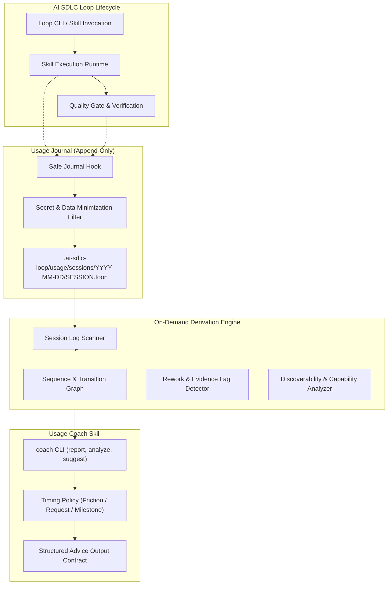

# Design

## Overview
The usage coach architecture makes AI SDLC Loop self-observing using a local, repository-native, event-sourced behavioral feedback loop without remote telemetry, databases, or productivity scoring. It consists of two complementary components: (A) a deterministic local usage journal storing immutable session events in `.toon` format, and (B) an interactive usage coach skill (`ai-sdlc-loop-usage-coach`) providing evidence-backed observations and guidance.

## Architecture
The system follows a strict event-sourcing model where historical session files in `.ai-sdlc-loop/usage/sessions/<date>/<session_id>.toon` serve as the sole source of truth.



### Journaling Runtime
- Implemented in `ai-sdlc-loop-shared-runtime/scripts/usage_journal.py`.
- Lightweight functions `record_event(type, data, root=...)` called during skill start/end, quality checks, verification, and transitions.
- Each session file is append-only with root dictionary metadata:
  ```toon
  schema: ai-sdlc-loop-usage/v1
  session_id: 20260928T094812Z-a83f
  started_at: 2026-09-28T09:48:12Z
  project_ref: sha256:...
  runtime_version: 0.10.1

  events:
    e000001:
      seq: 1
      ts: 2026-09-28T09:48:14Z
      type: session.start
  ```
- New events are appended atomically with a strictly incrementing sequence key `e<seq:06d>`.
- Fail-open execution: all I/O is wrapped with exception guards; failure to log never interrupts SDLC operations.

### Analytics Derivation Engine
- Analytics are computed purely on-demand across session files.
- No mutable global state, database, or summaries are stored.
- Derives:
  - Skill coverage: execution count, latest usage, phase, trigger distribution.
  - Discoverability: manual choice vs handoff vs router vs coach vs recovery.
  - Transition graph: weighted Markov transition frequencies and motifs.
  - Rework detection: cyclical patterns ($A \to B \to A$) and gate-repair loops.
  - Gate timing and evidence lag: distance in steps and time between implementation and verification.
  - Decision churn: repeated updates to identical requirement/decision references.
  - Ignored recommendations: tracking when suggested skills were bypassed.

## Components
1. `usage_journal.py` in `ai-sdlc-loop-shared-runtime`: Session initialization, append-only event serializer, redactor, fail-safe runner, and session log scanner.
2. `coach.py` in `ai-sdlc-loop-usage-coach`: Analysis engine, pattern matching, trigger policy, and CLI subcommands (`report`, `analyze`, `suggest`, `feedback`, `explain`).
3. Loop Runtime Integration: Event emission in `loop.py`, `engineering_quality_gate.py`, and `flow.py`.
4. Coach Skill Artifacts: `SKILL.md`, `steps/manifest.toon`, `references/chat-output.toon`, and unit/integration test suites.

## Interfaces and Contracts
- CLI Interface: `python3 skills/ai-sdlc-loop-usage-coach/scripts/coach.py <subcommand> [options]`
  - `report [--sessions N] [--window DAYS] [--format toon|text]`
  - `analyze [--session ID]`
  - `suggest [--current-skill S] [--task-kind K]`
  - `feedback --suggestion-id ID --outcome accepted|rejected [--notes TEXT]`
  - `explain <signal_name>`
- Chat Output Contract: Structured markdown conforming to `Observation`, `Pattern`, `Evidence`, `Suggestion`, `Alternative`, and `Value rationale`.
- Deterministic Execution Contract: D (deterministic entrypoint with bounded inputs), S (interpret session facts), H (validate advice before user presentation; never grant execution authority).

## Data Model
- Session Header: `schema`, `session_id`, `started_at`, `project_ref`, `runtime_version`.
- Event Structure:
  - `seq` (integer, monotonically increasing)
  - `ts` (ISO 8601 UTC timestamp)
  - `type` (dot-notated event type)
  - Contextual attributes: `skill`, `trigger`, `phase`, `task_kind`, `status`, `duration_ms`, `findings`, `transition_type`, etc.

## Error Handling
- Logging failures fail open: any exception during journal write is caught and recorded to local stderr/debug without bubbling up to the caller.
- Corrupted session files are skipped during scanning with a warning rather than aborting analysis.
- Malformed inputs to coach CLI return structured error output and non-zero exit codes.

## Security Considerations
- Zero external network connectivity: all processing is 100% local.
- Secret redaction: regex filters strip tokens matching API keys, passwords, and authorization headers from event metadata.
- Data minimization: no user prompts, source code diffs, or model prose are written to journal files.
- Read-only analysis: coach reads session files and writes only to append-only journals or optional feedback entries; never modifies project source or specs.

## Observability
- All operations derive observable evidence from the session `.toon` files.
- Coach CLI provides `--verbose` and diagnostic introspection into scanned session counts, discarded corrupted files, and pattern confidence scores.

## Risks and Tradeoffs
- Tradeoff: On-demand scanning vs pre-aggregated DB. Decision: Scanning local `.toon` files avoids mutable state corruption, keeps git clean, and is extremely fast for repository-scale histories (< 50 ms for hundreds of sessions).
- Risk: Advice fatigue. Mitigation: Enforce strict silence thresholds (e.g. silent during active flow, advice suppressed if similar suggestion was recently rejected).

## Validation Strategy
- Unit tests for `usage_journal.py` (atomic appends, sequence ordering, secret redaction, fail-open resilience).
- Unit tests for `coach.py` (metric derivation, motif detection, advice formatting).
- Scenario tests A through F verifying canonical flow, late gating, rework cycles, ignored recommendations, handoff discoverability, and capability gaps.
- Verification across Loop test suites and packaging smoke tests.

## Migration Notes
- Fully additive: existing workflows and skills are unaffected if journaling is disabled or no historical sessions exist.
- New skill is registered as the 28th skill in AI SDLC Loop.
